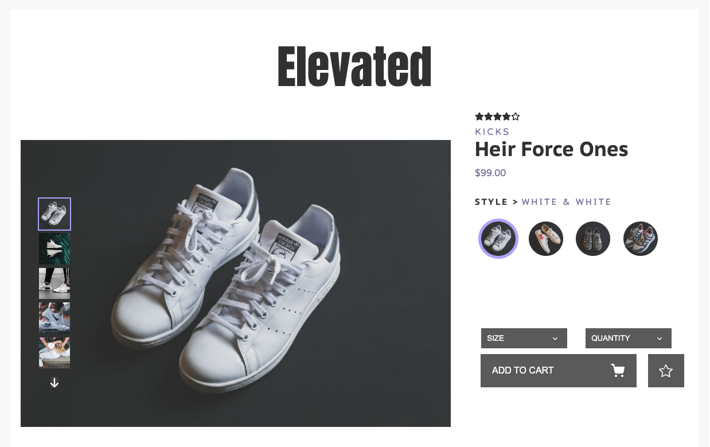
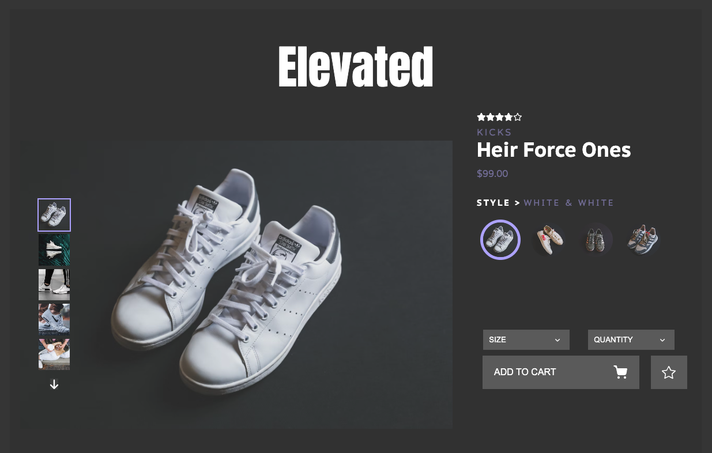
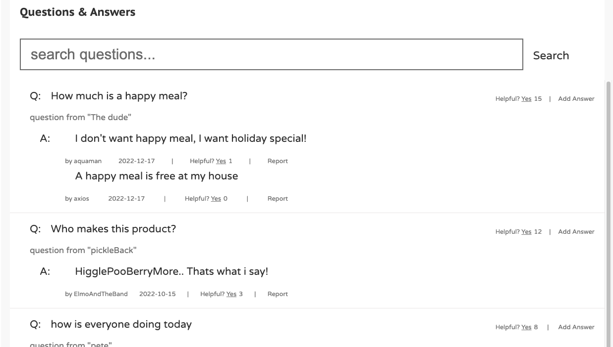
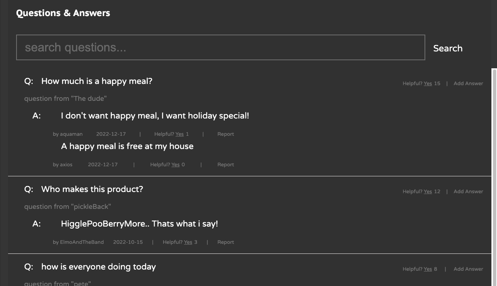
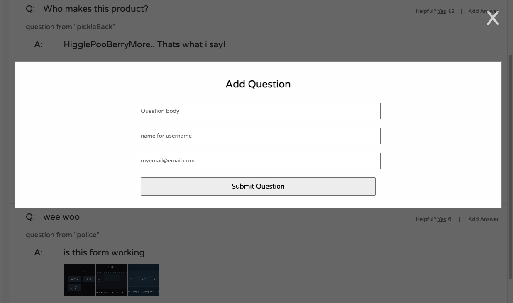
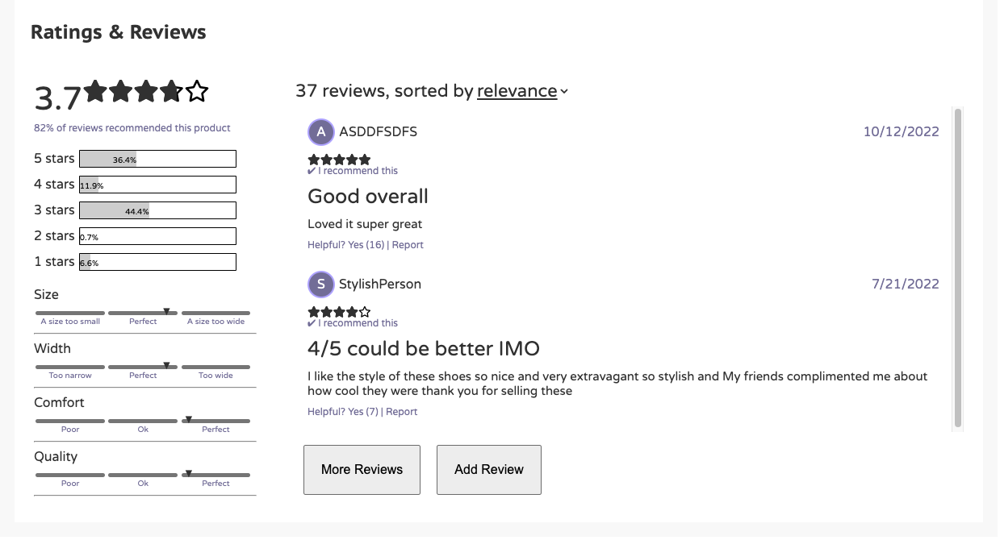
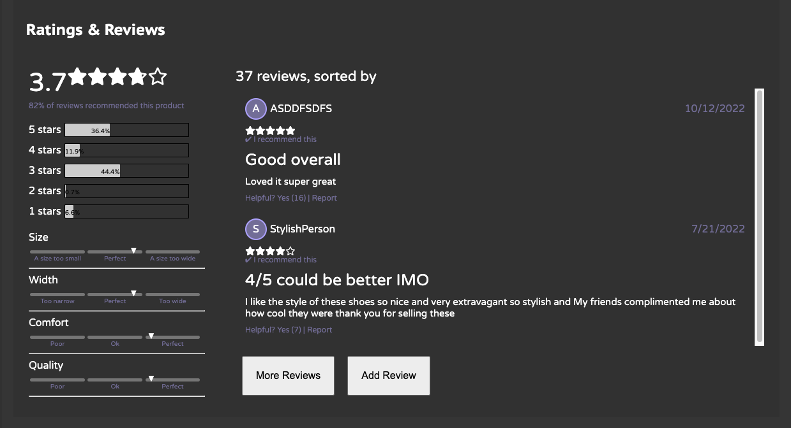
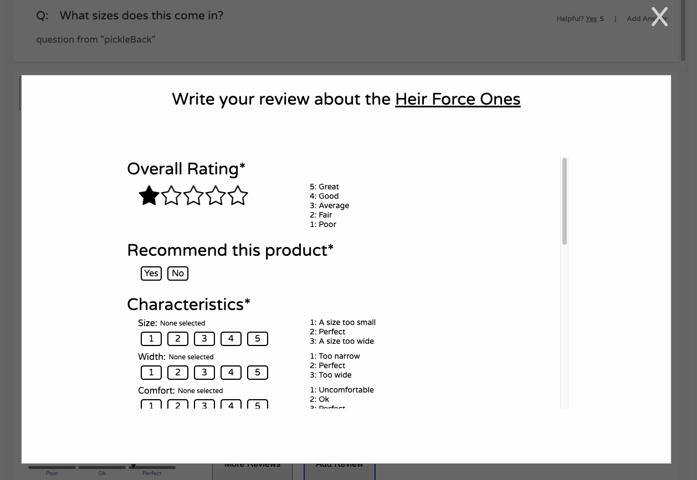

# Elevated

Simplistic yet modern e-commerce site designed with the user in mind.

## Authors

[Aristotle Jalalianfard](https://github.com/n0kam1)\
[Evan OShea](https://github.com/evanoshea21)\
[Kimberly Cheung](https://github.com/kimberlywycheung)\
[Ryan Gehris](https://github.com/RyanGehris)

## Built With


## Overview

#### Features

- Interactive image gallery with zoom-in features
- Details page describing product attributes and pricing
- Styles selector along with a user-friendly size guide




## Related Products & Your Outfit

#### Features

##### Product Cards:
* Each product card highlights the product’s default image, category, name, price (and sale price, when applicable), and star ratings.
* Each product card is clickable, and will update the product page when clicked.
* Each card and its corresponding action button (in the top right corner) have hover states so the user has immediate feedback on clickability.

##### Related Products Carousel:
* Shows a scrollable list of related products similar related products to the one the user is currently viewing
* Each card has a star icon that indicates whether the product has already been added to the user’s ”Your Outfit” section.
* The user can access a scrollable comparison modal from the product card that allows the user to compare the features of the related product to the currently viewed product. It highlights each product’s feature characteristics if applicable.

##### Your Outfits Carousel:
* Scrollable list of products the user has saved.
* Users can manage their outfit by adding or deleting products from their favorites via the Add to Outfit or delete buttons.
* The Add to Outfit card adds the currently viewed product to the “Your Outfit” list.
* Allows for persistence of list across different sessions, as long as the relevant cookies exist.
* Maintains a saved list of unique products only.


<details>
    <summary>See Comparison Details</summary>


</details>

## Questions & Answers

#### Features

- Search functionality to filter questions by title
- Question and Answers lists with Load More functionality
- Question and Answer modals for adding to the list




<details>
    <summary>See Q&A Forms</summary>



</details>

## Ratings & Reviews

#### Features

- Filter reviews by rating, or sort using the dropdown
- Visual represention of the breakdown of product ratings and characteristics
- A custom form for adding reviews




<details>
    <summary>See R&R Form</summary>



</details>

## Getting Started

Installation

- Clone the repository
  ```
      git clone https://github.com/atelier-front-end/elevated.git
  ```
- Install the dependencies
  ```
      npm install
  ```
- Create a new .env file with the following within

  ```
      GITHUB_TOKEN='Insert API token'
  ```

- Run the following script
  ```
      npm run build
      npm run start
  ```
