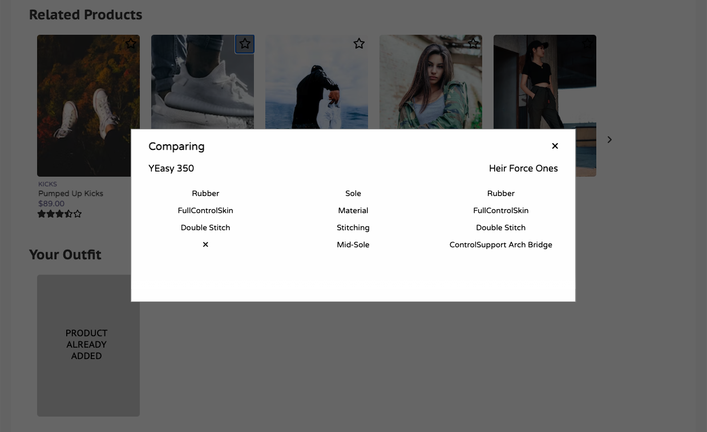

# Elevated

Simplistic yet modern e-commerce site designed with the user in mind.

## Authors

[Aristotle Jalalianfard](https://github.com/n0kam1)\
[Evan OShea](https://github.com/evanoshea21)\
[Kimberly Cheung](https://github.com/kimberlywycheung)\
[Ryan Gehris](https://github.com/RyanGehris)

## Built With


## Overview

#### Features

- Interactive image gallery with zoom-in features
- Details page describing product attributes and pricing
- Styles selector along with a user-friendly size guide


## Related Products & Your Outfit

#### Features

- A carousel displaying related products
- A modal comparing product features
- A list of products saved by the user


<details>
    <summary>See Comparison Details</summary>



</details>

## Questions & Answers

#### Features

- Search functionality to filter questions by title
- Question and Answers lists with Load More functionality
- Question and Answer modals for adding to the list


<details>
    <summary>See Q&A Forms</summary>


</details>

## Ratings & Reviews

#### Features

- Filter reviews by rating, or sort using the dropdown
- Visual represention of the breakdown of product ratings and characteristics
- A custom form for adding reviews


<details>
    <summary>See R&R Form</summary>


</details>

## Getting Started

Installation

- Clone the repository
  ```
      git clone https://github.com/atelier-front-end/elevated.git
  ```
- Install the dependencies
  ```
      npm install
  ```
- Copy example.env file and rename to .env with the following within

  ```
      GITHUB_TOKEN='Insert API token'
  ```

- Run the following script
  ```
      npm run build
      npm run start
  ```
